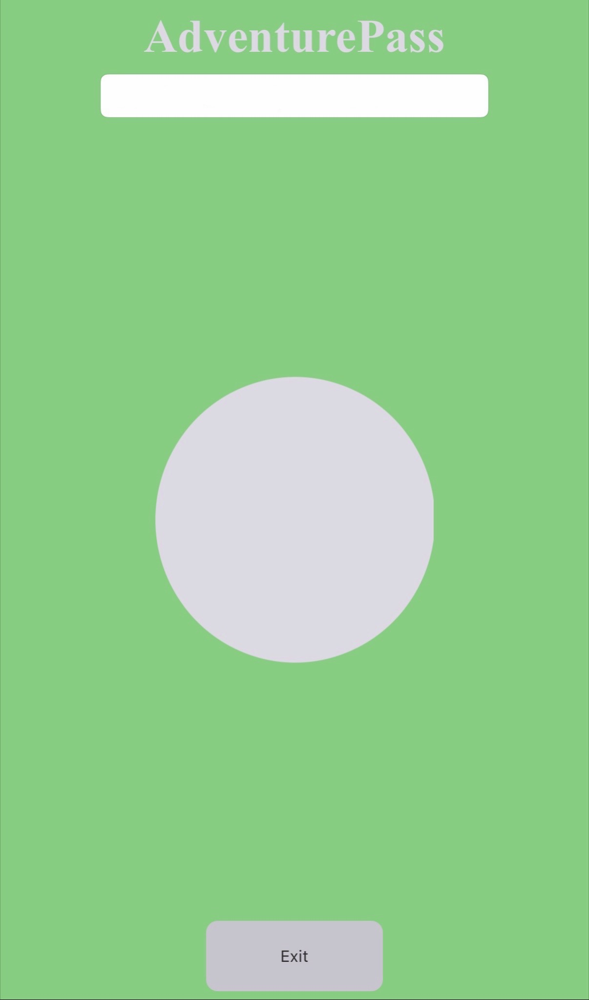

# AdventurePass

pick a spot on earth, get an arrow, go find it.

i wanted to see how minimal navigation could get before it stopped being navigation. no maps, no turn by turn, no map sdks. just gps, the phone's compass, and some bearing math.

type where you want to go. an arrow rotates to point at it. when you arrive, the screen turns green. that's the whole app.




live: https://adventurepass.vercel.app/ (iphone for now)

## the math

every time the orientation updates, `atan2` on the delta between your coords and the destination gives a bearing. subtract the phone's compass heading. rotate the arrow svg by that. that's the trick.

autocomplete is geoapify, debounced 200ms with an abortcontroller so it's not hammering the api on every keystroke.

ios gives the compass heading as `webkitCompassHeading`. android wants `alpha` from `deviceorientationabsolute`, and even then it's flaky. one of those quiet web mobile dev annoyances.

## stack

vanilla js + vite, pure css. no frameworks, no runtime dependencies.

## running it

```bash
npm install
npm run dev
```

drop your own geoapify key in `src/main.js` if you want autocomplete to work.

## what's broken

android compass is unreliable, working on it. arrival check rounds coords to 4 decimals (about 11m), so it's a square zone instead of a real radius. good enough for now. tapping outside the dropdown doesn't close it. hitting enter while navigating does nothing. future me's problem.

started as "how little code do you actually need for navigation" and the answer turned out to be embarrassingly little.
